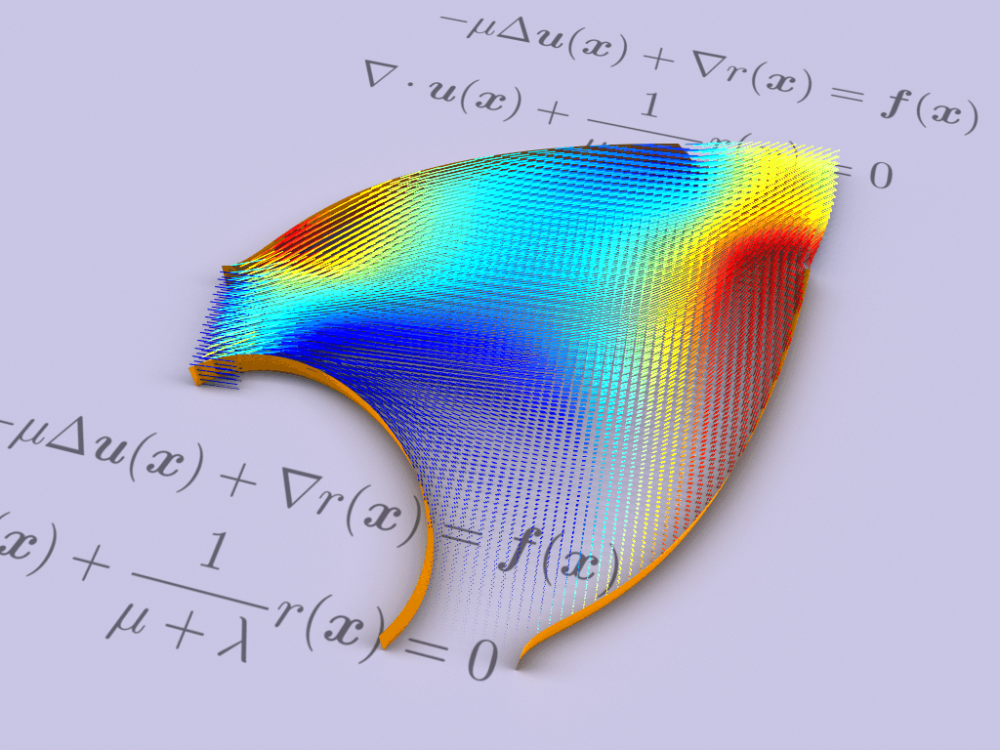

Codebase for **Functional Optimization of Fluidic Devices with Differentiable Stokes Flow**

[](https://travis-ci.org/mit-gfx/diff_stokes_flow)

## System requirement
- Ubuntu 18.04
- (Mini)conda 4.7.12 or higher

## Installation
```
git clone --recursive https://github.com/mit-gfx/diff_stokes_flow.git
cd diff_stokes_flow
conda env create -f environment.yml
conda activate diff_stokes_flow
./install.sh
```
### (Optional) Configuring Pardiso
Let `<PARDISO_HOME>` be the folder that you saved your Pardiso license file and the binary file. For example, if `/home/pardiso/pardiso.lic` and `/home/pardiso/libpardiso600-GNU720-X86-64.so` are your license and binary files, then `<PARDISO_HOME>=/home/pardiso`.
- Set `PARDISO_LIC_PATH` and `OMP_NUM_THREADS`:
```
export OMP_NUM_THREADS=4
export PARDISO_LIC_PATH=<PARDISO_HOME>
export PARDISOLICMESSAGE=1
```
- Pardiso requires `lapack` and `blas`:
```
sudo apt-get install liblapack-dev
sudo apt-get install libblas-dev
```
As of the date this README is written, the version we use is `3.7.1-4ubuntu1`:
```
Reading package lists... Done
Building dependency tree
Reading state information... Done
libblas-dev is already the newest version (3.7.1-4ubuntu1).
liblapack-dev is already the newest version (3.7.1-4ubuntu1).
0 upgraded, 0 newly installed, 0 to remove and 132 not upgraded.
```
- Recompile the codebase with an optional `pardiso` argument:
```
./install.sh pardiso
```

## Examples
Navigate to the `python/example` folder before you run any of the following scripts.

### Results in the paper
Run `python run_demo.py [demo_name]` where `[demo_name]` can be any of the following;
- `amplifier`: run the `Amplifier` demo (Fig. 2) in the paper.
- `flow_averager`: run the `Flow Averager` demo (Fig. 4) in the paper.

- `superposition_gate`: run the `Superposition Gate` demo (Fig. 4) in the paper.


Run `python refinement.py` to generate Fig. 8 in the paper.

### Numerical tests
Run `python [script_name].py` where `[script_name]` can be any of the following:
- `bezier_2d`: show the level-set of a Bezier curve and check the implementation of gradients.
- `cell_2d`: check if all quantities in `Cell2d` are implemented correctly.
- `scene_2d`: check the gradients of loss defined in a 2-dimensional scene.
- `shape_composition_2d` and `shape_composition_3d`: check the gradients of composing multiple primitive level-sets.
Finally, if you would like to run all these numerical experiments above, you can simply call `run_all_tests`:
- `run_all_tests`: this will sequentially run all the aforementioned numerical tests.

### Rendering
Run `python pbrt_renderer_demo.py` to see how to use the Python wrapper of pbrt-v3.

Additionally, we have also providd a few Python scripts for generating figures in the presentation:
- `draw_pipeline`: generate each subfigure in the whole pipeline.
- `draw_design`: generate pictures for the design section.
- `draw_optimization`: generate video and pictures for the optimization section.